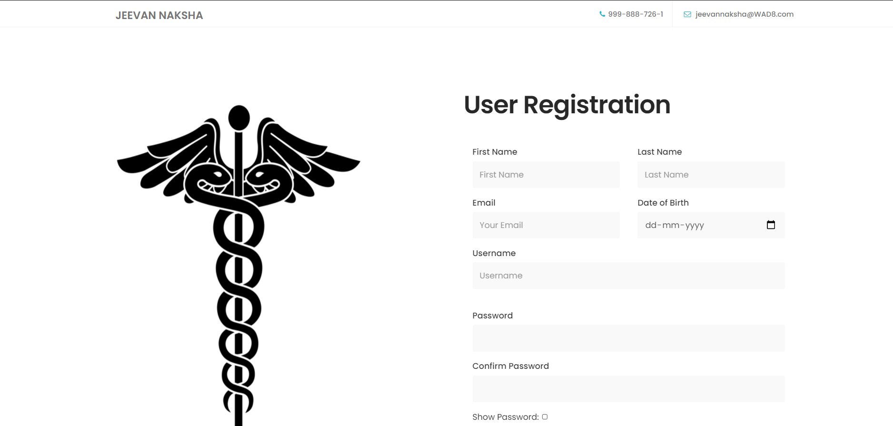
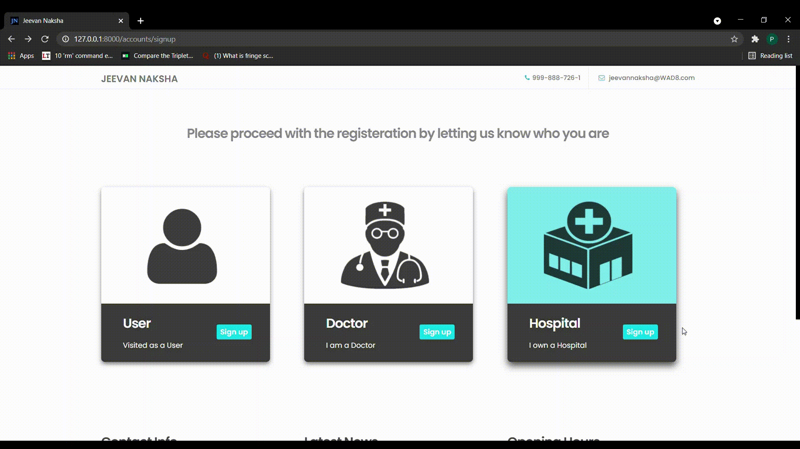

# Best Doctors and Hospitals Tracker

## **How to register in the website as a user**

Below are the steps for registering as a User:

* From Main page,go to SignIn page.

* For Registering as a new User click SignUp below forgot password.

* In signup page, click Signup as a user.

* After clicking SignUp as a User, you will get a Registration form as shown below.

* In User Registration Form, Fill all the details asked in the form and make sure the requirements are fulfilled like in Password it should contain a Capital letter and some special characters.

* After filling all details required in the form click on Register Button.

* After registering successfully, you will redirect to the main page with a message showing **Activate your account after clicking the link sent to your mail**.

* Now, go to your registered mail and you can find a mail from **jeevannakshawad** with a activation link for your account.

* Click on that link, now you are succesfully registered as a User and you will be redirected to the main page with the message **Account Activated Succesfully**.

#### **Now you're succesfully registered as a User.**

### **Below are the some of errors you can encounter when you register**
* If Password and Confirm Password are not same it will show **Passwords dont match** error. So make sure you enter the both passwords correctly.
* If any user registered with the same username before you register, it shows **UserName Already Exists**. So, Try with a different username.
* If any user registered with the same email before you register or if you're registering 2nd time with the same email, it shows **Email already Exists** error. So, make sure you enter your email correctly.

