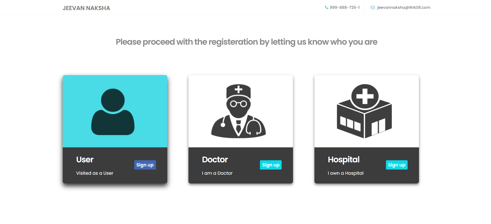

# Best Doctors and Hospitals Tracker

## **How to register in the website as a user**

Below are the steps for registering as a User:

1.From Main page,go to SignIn page.
2.For Registering as a new User click SignUp below forgot password.

3.In signup page, click Signup as a user as shown below.

4.After clicking SignUp as a User, you will get a Registration form as shown below.

5.In User Registration Form, Fill all the details asked in the form and make sure the requirements are fulfilled like in Password it should contain a Capital letter and some special characters.
6.After filling all details required in the form click on Register Button.

### **Below are the some of errors you can encounter when you register**
1. If Password and Confirm Password are not same it will show **Passwords dont match** error. So make sure you enter the both passwords correctly.
2. If any user registered with the same username before you register, it shows **UserName Already Exists**. So, Try with a different username.
3. If any user registered with the same email before you register or if you're registering 2nd time with the same email, it shows **Email already Exists**. So, make sure you enter your email correctly.

